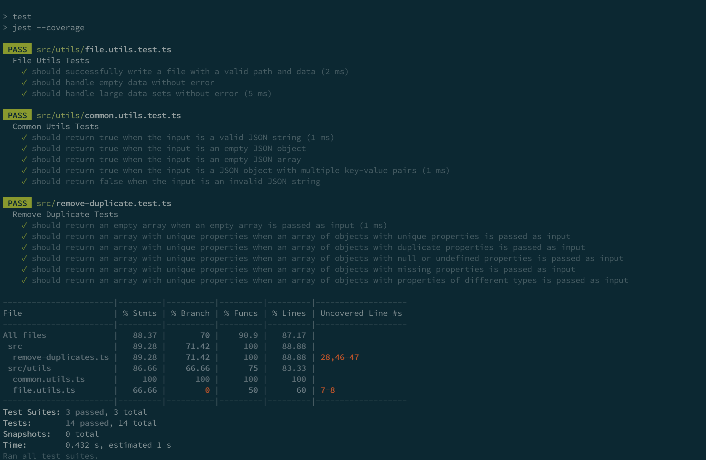

# Knack Node Code Challenge

[](https://github.com/abritopach)

## ℹ️ Description

### Remove Duplicates From Mock Knack Application Schema

Knack is a no-code platform that includes an online database. Knack users will at times, through unexpected API usage or an unknown bug, corrupt their application schemas. One common issue they may run into is having duplicate fields and/or objects in their application schema. These duplicates cannot be removed by the Knack UI and lead to TypeErrors and other problems.

The purpose of this coding exercise is to create a Node.js application that can programmatically remove all duplicate fields and objects from the given mock application schema and output a new sanitized version.

The "mock_application.json" file in this repository contains data which represents an actual Knack application schema including all currently existing properties. Your code should process the data, remove any duplicates, and output a new JSON file "clean_application.json" which retains all other properties of the Knack application.

Within a standard Knack application there is a `versions` property which has 2 collections:
1. `objects`: an array of Knack "objects" which contains "fields"
2. `scenes`: an array of Knack "scenes" which contains "views"

#### Requirements
- The code should be written in Javascript or Typescript and utilize the Node.js framework
- We expect tests (unit tests on business logic, etc. - whatever you are comfortable with)
- We expect to see documentation in the form of a README
- We're looking for code that would be easy to maintain
- We're looking for code that would scale

#### Time
We understand that you are busy and programming projects can take a long time. We advise spending 2 hours on the exercise and seeing where you get. If there are still open requirements at the end of the 2 hour period, feel free to outline what it would take to complete those in TODO comments inline in the code, or a list of notes on what you'd need to do finish things up. If you want to keep working and take things over the finish line, great.

#### Notes
- Leveraging 3rd party libraries/modules is perfectly fine

#### How to submit your solution
- Please send us a zip or a tar of the `node-coding-exercise-master` directory which should include your application

## 💡 Proposed solution

It was decided to use typescript to solve this code challenge.

The project folder structure is as follows:

``` bash
    /src
        /assets
            /data
                /mocks
                    mock_application.json -> JSON Mock of a Knack application.
        /models -> Model of a Knack application coming from a supposed API Rest request.
        /utils
            common.utils.ts -> Common utilities used in the solution.
            file.utils.ts -> Utilities for working with files (in this case only write to file, but we could have read, delete,... functionality).
        remove-duplicates.ts -> File containing the proposed solution.
    .gitignore
    nodemon.json
    package-lock.json
    package.json
    README.md
    tsconfig.json
```

Technologies / languages: Node.js & TypeScript.

### ❗ Important notes that I have taken into account when solving the code challenge

* **I have assumed that there are a number of default attributes that cannot be duplicated, such as**


``` bash
{
    "_id": "61e8666b010a37023e3d99a3",
    "users": {
        "enabled": true,
        "scope": "scene",
        "registration": "closed"
    },
    "ecommerce": {
        "enabled": false
    },
    "counts": {
        "total_entries": 0,
        "asset_count": 0,
        "asset_size": 0
    },
    "field_count": 31,
    "thumb_count": 0,
    "object_count": 5,
    "task_count": 0,
    "view_count": 10,
    "scene_count": 9,
    "credential_count": 0,
    "status": "active",
    "settings": {
        ...
    }
    ...
}
```

**and that as indicated in the test the attributes that can be duplicated are within the `versions` field.**

* **I have assumed that when duplicates occur the system generates a unique _id but in reality, the information entered by the customer is the same even if this _id is different. For example**

<table>
<tr>
<th>
    Line 428 - Versions > Objects > Employees
</th>
<th>
    Line 531 - Versions > Objects > Employees
</th>
</tr>

<tr>

<td>
<pre>
    {
        "inflections": {
            "singular": "Employee",
            "plural": "Employees"
        },
        "connections": {
            "inbound": [],
            "outbound": []
        },
        "name": "Employees",
        "user": true,
        "status": "current",
        "tasks": [],
        "type": "UserObject",
        "_id": "61e86a181137bc002545fef8",
        "fields": [{
                "type": "name",
                "required": true,
                "unique": false,
                "user": true,
                "conditional": false,
                "rules": [],
                "validation": [],
                "_id": "61e86a181137bc002545fefa",
                "name": "Name",
                "format": {
                    "format": "First Last"
                },
                "immutable": true,
                "key": "field_17"
            },
            {
                "type": "email",
                "required": true,
                "unique": true,
                "user": true,
                "conditional": false,
                "rules": [],
                "validation": [],
                "_id": "61e86a181137bc002545fefb",
                "name": "Email",
                "format": {
                    "text_format": "url",
                    "label": ""
                },
                "immutable": true,
                "key": "field_18"
            },
            {
                "type": "password",
                "required": true,
                "unique": true,
                "user": true,
                "conditional": false,
                "rules": [],
                "validation": [],
                "_id": "61e86a181137bc002545fefc",
                "name": "Password",
                "format": null,
                "immutable": true,
                "key": "field_19"
            },
            {
                "type": "multiple_choice",
                "required": true,
                "unique": false,
                "user": true,
                "conditional": false,
                "rules": [],
                "validation": [],
                "_id": "61e86a181137bc002545fefd",
                "name": "User Status",
                "format": {
                    "options": [
                        "active",
                        "inactive",
                        "pending approval"
                    ],
                    "default": "active"
                },
                "immutable": true,
                "key": "field_20"
            },
            {
                "type": "user_roles",
                "required": false,
                "unique": false,
                "user": true,
                "conditional": false,
                "rules": [],
                "validation": [],
                "_id": "61e86a181137bc002545fefe",
                "name": "User Roles",
                "immutable": true,
                "key": "field_21"
            }
        ],
        "template": "",
        "key": "object_4",
        "profile_key": "profile_4",
        "identifier": "field_17"
    }
</pre>
</td>

<td>
<pre>
    {
        "inflections": {
            "singular": "Employee",
            "plural": "Employees"
        },
        "connections": {
            "inbound": [],
            "outbound": []
        },
        "name": "Employees",
        "user": true,
        "status": "current",
        "tasks": [],
        "type": "UserObject",
        "_id": "61e86a181137bc002545fef9",
        "fields": [{
                "type": "name",
                "required": true,
                "unique": false,
                "user": true,
                "conditional": false,
                "rules": [],
                "validation": [],
                "_id": "61e86a181137bc002545fefa",
                "name": "Name",
                "format": {
                    "format": "First Last"
                },
                "immutable": true,
                "key": "field_17"
            },
            {
                "type": "email",
                "required": true,
                "unique": true,
                "user": true,
                "conditional": false,
                "rules": [],
                "validation": [],
                "_id": "61e86a181137bc002545fefb",
                "name": "Email",
                "format": {
                    "text_format": "url",
                    "label": ""
                },
                "immutable": true,
                "key": "field_18"
            },
            {
                "type": "password",
                "required": true,
                "unique": true,
                "user": true,
                "conditional": false,
                "rules": [],
                "validation": [],
                "_id": "61e86a181137bc002545fefc",
                "name": "Password",
                "format": null,
                "immutable": true,
                "key": "field_19"
            },
            {
                "type": "multiple_choice",
                "required": true,
                "unique": false,
                "user": true,
                "conditional": false,
                "rules": [],
                "validation": [],
                "_id": "61e86a181137bc002545fefd",
                "name": "User Status",
                "format": {
                    "options": [
                        "active",
                        "inactive",
                        "pending approval"
                    ],
                    "default": "active"
                },
                "immutable": true,
                "key": "field_20"
            },
            {
                "type": "user_roles",
                "required": false,
                "unique": false,
                "user": true,
                "conditional": false,
                "rules": [],
                "validation": [],
                "_id": "61e86a181137bc002545fefe",
                "name": "User Roles",
                "immutable": true,
                "key": "field_21"
            }
        ],
        "template": "",
        "key": "object_4",
        "profile_key": "profile_4",
        "identifier": "field_17"
    }
</pre>
</td>

</tr>
</table>

<table>
<tr>
<th>
    Line 162 - Versions > Objects > Fields > Description
</th>
<th>
    Line 174 - Versions > Objects > Fields > Description
</th>
</tr>

<tr>

<td>
<pre>
{
    "type": "paragraph_text",
    "required": false,
    "unique": false,
    "user": false,
    "conditional": false,
    "rules": [],
    "validation": [],
    "_id": "61e869d51137bc002545fee1",
    "name": "Description",
    "key": "field_4"
}
</pre>
</td>

<td>
<pre>
{
    "type": "paragraph_text",
    "required": false,
    "unique": false,
    "user": false,
    "conditional": false,
    "rules": [],
    "validation": [],
    "_id": "61e869d51137bc002545fee2",
    "name": "Description",
    "key": "field_4"
}
</pre>
</td>

</tr>
</table>

<table>
<tr>
<th>
    Line 833 - Scenes - Views - Menu
</th>
<th>
    Line 867 - Scenes - Views - Menu
</th>
</tr>

<tr>

<td>
<pre>
{
    "columns": [],
    "links": [{
            "name": "Products",
            "type": "scene",
            "scene": "products"
        },
        {
            "name": "Orders",
            "type": "scene",
            "scene": "orders"
        }
    ],
    "inputs": [],
    "_id": "61e86a5d1137bc002545ff11",
    "groups": [],
    "format": "none",
    "label": "Menu",
    "name": "Menu",
    "type": "menu",
    "title": "",
    "description": "",
    "source": {
        "criteria": {
            "match": "all",
            "rules": [],
            "groups": []
        },
        "limit": "",
        "sort": [],
        "type": "database"
    },
    "key": "view_4"
}
</pre>
</td>

<td>
<pre>
{
    "columns": [],
    "links": [{
            "name": "Products",
            "type": "scene",
            "scene": "products"
        },
        {
            "name": "Orders",
            "type": "scene",
            "scene": "orders"
        }
    ],
    "inputs": [],
    "_id": "61e86a5d1137bc002545ff11",
    "groups": [],
    "format": "none",
    "label": "Menu",
    "name": "Menu",
    "type": "menu",
    "title": "",
    "description": "",
    "source": {
        "criteria": {
            "match": "all",
            "rules": [],
            "groups": []
        },
        "limit": "",
        "sort": [],
        "type": "database"
    },
    "key": "view_4"
}
</pre>
</td>

</tr>
</table>

### Explanation

The method that takes care of cleaning duplicate items is called `sanitizeFile(knackAppData: KnackApplication, filePath: string)` and is located inside the `src/remove-duplicates.ts` file.

I have added two additional checks (`isValidJson && isValidKnackApp`) that check that it is a valid json and that this json follows the KnackAppData schema.

Then it iterates the array of versions looking for possible duplicates in the objetcs, fields and views fields.

Using the javascript `Set` object, what we do is to iterate the array of objects we pass it, discarding the _id of the duplicated elements (as I have previously commented, I have assumed that this _id is automatically generated by the system) and keeping the rest of the properties.

This way doing a JSON.stringify we generate a unique key for the Set. If we get a similar key it will not be added to the set.

I have tried to generate a second version (non-recursive version that iterates through the json keys). I have decided to make it a non-recursive version because of the issue that if object is "big" in terms of nested items, we'll get a stack overflow error. I have not been able to finish this version but I leave it up for discussion.

``` bash
function sanitizeFile2(data: any) {
    const result: any = {};
    const stack = [data];
    while (stack?.length > 0) {
        const currentObj = stack.pop();
        Object.keys(currentObj).forEach(key => {
            console.log(`key: ${key}, value: ${currentObj[key]}`);
            if (Array.isArray(currentObj[key]) && currentObj[key].length > 1) {
                result[key] = removeDuplicates(currentObj[key]);
            } else if (isPrimitive(currentObj[key])) {
                result[key] = currentObj[key];
            } else if (typeof currentObj[key] === 'object' && currentObj[key] !== null) {
                stack.push(currentObj[key]);
            }
        });
    }
    writeFile('./src/clean_application2.json', JSON.stringify(result, null, 4));
}
```

**NOTE:** I probably could have used third-party dependencies such as [Underscore](https://underscorejs.org/) / [Lodash](https://lodash.com/) to solve this code challenge.

### ☁️ Generating the models (interfaces & types) from JSON

To speed up this process I have used an online tool that generates the corresponding typescript interfaces / types given a json.

### ⚙️ How to Setup a TypeScript + Node.js Project

Based on the initial draft project, typescript has been configured as follows:

#### Add TypeScript as a dev dependency

``` bash
npm install typescript --save-dev
```

### Install ambient Node.js types for TypeScript

TypeScript has Implicit, Explicit, and Ambient types. Ambient types are types that get added to the global execution scope. Since we're using Node, it would be good if we could get type safety and auto-completion on the Node apis like file, path, process, etc.

``` bash
npm install @types/node --save-dev
```

### Create a tsconfig.json

``` bash
npx tsc --init --rootDir src --outDir build \
--esModuleInterop --resolveJsonModule --lib es6 \
--module commonjs --allowJs true --noImplicitAny true
```

### Add useful configurations & scripts

#### Cold reloading

Cold reloading is nice for local development. In order to do this, we'll need to rely on a couple more packages: ts-node for running TypeScript code directly without having to wait for it be compiled, and nodemon, to watch for changes to our code and automatically restart when a file is changed.

``` bash
npm install --save-dev ts-node nodemon
```

#### Add a nodemon.json config

``` bash
{
  "watch": ["src"],
  "ext": ".ts,.js",
  "ignore": [],
  "exec": "npx ts-node ./src/index.ts"
}
```

#### Add start:dev script in package.json

``` bash
"start:dev": "npx nodemon"
```

By running npm run start:dev, npx nodemon will start our app using npx ts-node ./src/remove-duplicates.ts, watching for changes to .ts and .js files from within /src.

## 🚀 How to run the app in development mode

Install the dependencies. Run `npm install` for a dev server.

Execute the app. Run `npm run start:dev`.

## 🚀 Production build

Although it is out of the scope of the code challenge if we want to create the production version we can add a build script.

Install rimraf, a cross-platform tool that acts like the rm -rf.

``` bash
npm install --save-dev rimraf
```

And then, add the script `build` in the package.json.

``` bash
"build": "rimraf ./build && tsc"
```

Now, when we run npm run build, rimraf will remove our old build folder before the TypeScript compiler emits new code to dist.

In order to start the app in production, all we need to do is run the build command first, and then execute the compiled JavaScript at build/remove-duplicates.js.

The startup script looks like this.

``` bash
"start": "npm run build && node build/remove-duplicates.js"
```

## Unit testing with Jest

### Steps to adding Jest to the project

 * Install Jest dependency

``` bash
npm install --save-dev jest
```

 * Install Jest types (@types/jest)

This package contains type definitions for Jest (https://jestjs.io/).

```bash
npm install --save-dev @types/jest
```

 * Install ts-jest

This is the TypeScript preprocessor for jest (ts-jest) which allows jest to transpile TypeScript on the fly and have source-map support built-in.

A Jest transformer with source map support that lets you use Jest to test projects written in TypeScript.

``` bash
npm install --save-dev ts-jest
```

 * Configure Jest

Add jest.config.ts file

``` bash
import type {Config} from 'jest';

const config: Config = {
  verbose: true,
  preset: 'ts-jest',
  testEnvironment: 'node',
};

export default config;
```

* Add the tests scripts in package.json

``` bash
"test": "jest --coverage",
"test:watch": "jest --watch"
```

### Test coverage

The current test coverage is as follows



**NOTE**: I would have liked to add more tests but I didn't have time.
